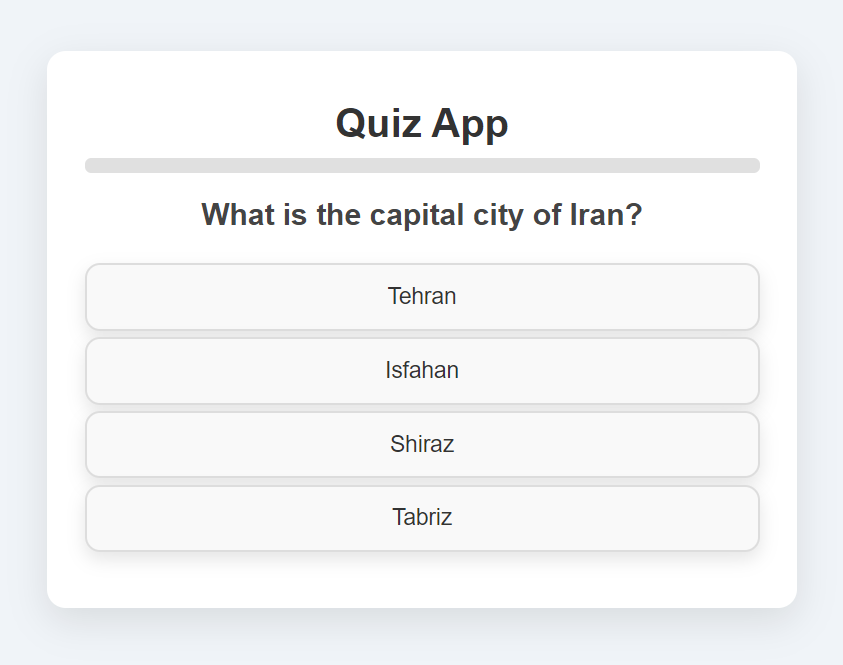
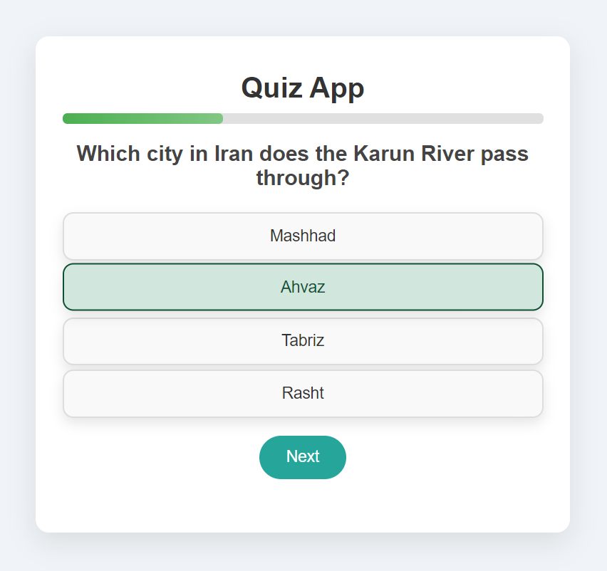
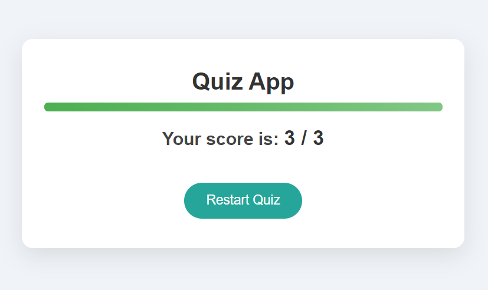

# Quiz App Project

This project is a simple Quiz App built with **JavaScript**, **HTML**, and **CSS**. It allows users to answer multiple-choice questions and provides feedback on their score. The quiz features progress tracking, interactive design, and dynamic question loading.

## Table of Contents
- [Screenshot](#screenshot)
- [Features](#features)
- [Built With](#built-with)
- [Prerequisites](#prerequisites)
- [Usage](#usage)
- [How to Add Questions](#how-to-add-questions)
- [Contact](#contact)

## Screenshot







<p align="right">(<a href="#table-of-contents">back to top</a>)</p>

## Features

- Multiple-choice quiz.
- Dynamic loading of questions from a JavaScript array.
- Score calculation based on correct answers.
- Progress bar that visually indicates progress through the quiz.
- Responsive and interactive UI with hover effects and animations.
- Results page showing final score after the quiz is completed.
- Option to restart the quiz after completion.
- "Next" button appears only after a choice is selected, keeping it centered on the screen.
- Simple method to add new questions to the quiz.

<p align="right">(<a href="#table-of-contents">back to top</a>)</p>

## Built With

This project was built using the following technologies:

- 
- 
- 

<p align="right">(<a href="#table-of-contents">back to top</a>)</p>

## Prerequisites

To run this project, all you need is a modern web browser that supports HTML, CSS, and JavaScript. No additional libraries or dependencies are required.

<p align="right">(<a href="#table-of-contents">back to top</a>)</p>

## Usage

1. Clone the project from GitHub or download the files:
   ```bash
   git clone https://github.com/AmirrezaAhmadi/Quiz-App.git

2. Locate the `questions` array:

   ```javascript
   const questions = [
       {
           question: "What is the capital city of Iran?",
           choices: ["Tehran", "Isfahan", "Shiraz", "Tabriz"],
           answer: 0
       },
       {
           question: "Which city in Iran does the Karun River pass through?",
           choices: ["Mashhad", "Ahvaz", "Tabriz", "Rasht"],
           answer: 1
       }
   ];
   ```

3. To add a new question, follow the format below:

   ```javascript
      {
         question: "Your new question here?",
         choices: ["Choice 1", "Choice 2", "Choice 3", "Choice 4"],
         answer: <index of the correct choice (starting from 0)>
      }
      ```

      Example:

   ```javascript
   {
       question: "What is the tallest mountain in the world?",
       choices: ["K2", "Everest", "Kangchenjunga", "Lhotse"],
       answer: 1 // Everest is the correct answer
   }
   ```
4. Save the script.js file. The new question will automatically appear in the quiz.

5. Open the QuizApp.html file in your browser.

<p align="right">(<a href="#table-of-contents">back to top</a>)</p>

## Contact

You can reach me through the following:

* Email: AmirrezaAhmadi.GH@Gmail.com
* Telegram: https://t.me/AmirrezaDevelop
* Instagram: https://www.instagram.com/codewithamirreza
* Project Link: https://github.com/AmirrezaAhmadi/Quiz-App.git

<p align="right">(<a href="#table-of-contents">back to top</a>)</p>


